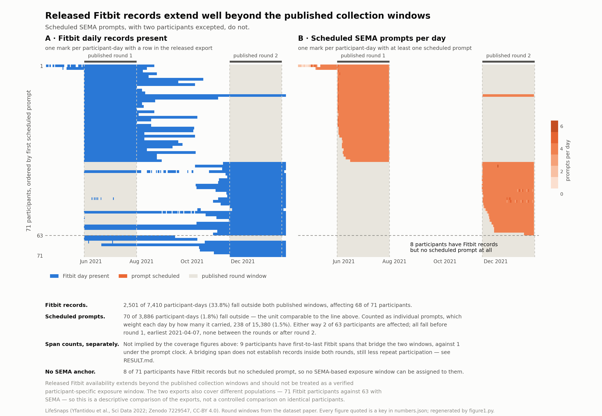
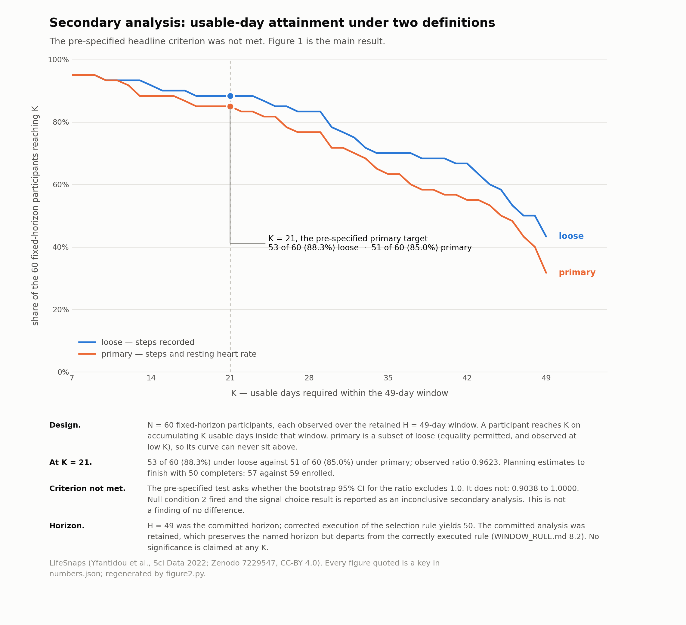

# Result — evaluated against the frozen specification

**2026-09-14.** Computed after `WINDOW_RULE.md` v2 was frozen. No parameter was changed
after these numbers were seen.

## Figure 1 — what the released records actually cover

`figure1.py` regenerates this in light and dark. It asserts every caption number against
`numbers.json` before writing, and refuses to write if any assertion fails.

The audit question: **can the released device records support the study window and
denominator an analysis assumes?** They cannot be used for that uncritically.

**Released Fitbit availability extends beyond the published collection windows and should not
be treated as a verified participant-specific exposure window.**

- **Fitbit records.** 2,501 of 7,410 **participant-days** (33.8%) fall outside both published
  collection windows, affecting **68 of 71** participants.
- **Scheduled prompts, same unit.** 70 of 3,886 **participant-days** (1.8%) fall outside.
- **Scheduled prompts, prompt-level.** 238 of 15,380 **individual prompts** (1.5%) fall
  outside. This denominator weights each day by how many prompts it carried, so it is *not*
  interchangeable with the participant-day figures; both are reported with their own
  denominators rather than compared directly.
- Either way, **2 of 63** participants are affected. All fall before round 1, the
  earliest on 2021-04-07; none between the rounds or after round 2. The prompts are therefore
  *largely* concentrated within the published windows — not confined to them, and an earlier
  draft of this file wrongly said confined.
- **Span counts, a separate finding.** 9 participants have first-to-last Fitbit spans that
  bridge the two windows, against 1 under the prompt clock. This does not follow from the
  coverage figures above; it is a different measurement. A bridging span also does not
  establish records inside both rounds, still less repeat participation. The dataset paper
  reports 1 repeat participant, which the prompt-clock count matches **in number**;
  identity is not verified here.
- **No SEMA anchor.** 8 of 71 participants have Fitbit records but no scheduled prompt, so
  no **SEMA-based** exposure window can be assigned to them. Whether another source could
  anchor them is a question for the separate survey audit, not settled here.

The two figures also rest on **different source populations** — 71 participants in the Fitbit
export against 63 with any SEMA prompt — so 33.8% versus 1.8% is a descriptive comparison of
the two exports, not a controlled comparison on identical participants. Device records and
scheduled prompts measure different events and have different missingness mechanisms, so they
are not expected to cover identical days, and the published windows are not assumed to capture
every legitimate study event — 70 prompt-days fall outside them.

This is the finding. Everything below is subordinate to it.

## Design as frozen

71 provenance → 63 SEMA-anchored → **H = 49** → **60 fixed-horizon** participants →
**K = 21** primary (K = 7–49 curve) → two signal definitions → paired participant
bootstrap → §5 null conditions.

**H = 49 was retained although corrected execution of the selection rule yields 50.** The
horizon was fixed at 49 before any outcome was seen. When the date-arithmetic defect was
corrected (`WINDOW_RULE.md` §8.1), re-executing the same mechanical rule — the largest
horizon retaining at least 95% of the 63 SEMA-anchored participants — returned 50, not 49
(60 of 63 are retained at both; 51 fails). We retained the explicitly committed H = 49 analysis after
discovering the discrepancy. This preserves the named horizon but departs from the correctly
executed selection rule. A reader who prefers H = 50 has everything needed to rebuild at 50.

Study day 0 is the date of each participant's first `SCHEDULED_TS`. This is a **chosen
study-generated exposure anchor, not a verified study start.** Nothing in the released
records establishes when anyone enrolled, consented or began wearing the device. The
anchor is defensible only because it is generated by the study and is present for 63 of
71 participants — not because it marks a start. Treating any single timestamp as more
than that is the error this audit exists to document. Only their first 49 study days
are evaluated. 2,922 participant-days fall inside the windows against a full grid of
2,940.

Study dates are calendar dates throughout; see WINDOW_RULE.md 8.1 for the date-arithmetic
defect corrected on 2026-09-14 and its effect on the numbers below.

## Primary comparison, K = 21 within H = 49

| Signal definition | Reaching K = 21 | Share | Enroll for 50 |
|---|---|---|---|
| loose (steps recorded) | 53 of 60 | 88.3% | 57 |
| primary (steps + resting HR) | 51 of 60 | 85.0% | 59 |

Paired participant bootstrap, 10,000 resamples. Both orientations are reported so the
pre-specified test and the operational comparison are each stated in their own terms:

> **Pre-specified primary test — usable-yield ratio (primary / loose)**
> observed 0.9623 (= 51 / 53); bootstrap median 0.9630, 95% CI 0.9038 to 1.0000
>
> **Operational orientation — enrollment multiplier (primary / loose)**
> observed 1.0351 (= 59 / 57); bootstrap median 1.0357, 95% CI 1.0000 to 1.1071

The observed values are point estimates computed directly from the counts. The medians are
resample medians and are **not** the observed values; they are reported separately so neither
is mistaken for the other.

Each bootstrap replicate is computed end to end, including the `ceil()` in the enrollment
calculation. The naive reciprocal of the yield interval gives 1.000–1.106, which differs,
because `ceil()` is not a smooth transform. **The verdict is invariant to orientation:
both intervals include 1.0.**

## §5 verdict

| Null condition | Status |
|---|---|
| 1 — no useful common horizon | not fired |
| **2 — ratio CI includes 1.0** | **FIRED** |
| 3 — fixed-horizon cohort < 40 | not fired |
| 4 — operationally trivial | not fired |

**The signal-choice sensitivity result is abandoned as a headline finding.** Per the
frozen specification it is reported only as an inconclusive secondary analysis.

**This is not a finding of no difference.** The pre-specified criterion was not met; that is
all. No equivalence is claimed and no absence of a meaningful difference is established.

Two separate facts about the upper endpoint, which an earlier draft ran together:

- **Why the ratio cannot exceed 1.0.** `primary` is a subset of `loose`, so every
  primary completer is a loose completer and the ratio is bounded above by 1.0 by
  construction. This is true of every possible sample, at any cohort size. The subset
  relation permits **equality**, and equality occurs: at K = 7 through 11 the two counts are
  identical and the ratio is exactly 1.0.
- **Why this interval reaches that bound.** Because the bootstrap distribution puts enough
  mass exactly at 1.0: 12.85% of replicates have a ratio of exactly 1.0 (and 0.00% exceed
  it, as they cannot), which is more than the 2.5% the upper percentile needs. That is a
  property of this resample, not of the construction.

The bound means the pre-specified test asks whether the interval includes a boundary of the
parameter space rather than an interior null — recorded in `WINDOW_RULE.md` as a defect of
the specification, with the verdict unchanged. The
interval reaches 1.0 at its upper boundary; the condition was written in advance and it
fired, and the boundary is not grounds for reinterpretation.

## Figure 2 — the secondary analysis

Both pre-specified attainment curves across K = 7–49, K = 21 marked, N = 60 fixed-horizon
participants over the retained H = 49-day window. `figure2.py` asserts its caption numbers
against `numbers.json` before writing, including that nesting holds at every K it draws.

**The pre-specified headline criterion was not met**, and the figure says so on its face. It
is reported because it was pre-specified, not because it establishes anything. The audit in
Figure 1 is the result.

## Pre-specified curve, selected points

Seven of the 43 pre-specified K values. The complete K = 7–49 curve is
`usable_day_curve_K7_to_K49` in `numbers.json`.

| K | loose | primary | ratio (from counts) |
|---|---|---|---|
| 7 | 57 of 60 (95.0%) | 57 of 60 (95.0%) | 1.0000 |
| 14 | 55 of 60 (91.7%) | 53 of 60 (88.3%) | 0.9636 |
| **21** | **53 of 60 (88.3%)** | **51 of 60 (85.0%)** | **0.9623** |
| 28 | 50 of 60 (83.3%) | 46 of 60 (76.7%) | 0.9200 |
| 35 | 42 of 60 (70.0%) | 38 of 60 (63.3%) | 0.9048 |
| 42 | 40 of 60 (66.7%) | 33 of 60 (55.0%) | 0.8250 |
| 49 | 26 of 60 (43.3%) | 19 of 60 (31.7%) | 0.7308 |

**Retracted:** an earlier version of this file said the ratio declines monotonically with
K. It does not. Each attainment curve is individually non-increasing, but their ratio
rises at several transitions (K = 13, 14, 24, 30, 32, 40, 42, 43, 45 → K+1), computed from counts rather than from rounded
percentages. See WINDOW_RULE.md 8.3. **No significance is claimed at any K**, and no alternative K, horizon, signal definition, threshold or
target completer count is adopted in place of the ones that were frozen.

## What changed against the original analysis

Stated as analysis history, not as an estimate of bias.

| | Original (Fitbit clock) | Corrected (SEMA clock) |
|---|---|---|
| Observation horizon | 63 days, Fitbit-anchored | 49 days, SEMA-anchored |
| Cohort | 71 | 60 |
| Target | K = 60 | K = 21 |
| Enrollment, loose | 119 | 57 |
| Enrollment, primary | 155 | 59 |
| **Enrollment multiplier, primary / loose (observed)** | **1.30** (= 155 / 119) | **1.0351** (= 59 / 57) |

Both rows are **observed** point estimates computed from the counts, so they are comparable to
each other; neither is a bootstrap median. The corrected analysis's bootstrap median is
1.0357 with a 95% CI of 1.0000 to 1.1071 — reported above, and not substituted for the observed
value here. Both multipliers are stated in the same orientation. The earlier report placed an
enrollment ratio beside a yield ratio, which are reciprocal-facing quantities and were
not comparable.

**The original 155-versus-119 result did not survive reconstruction of the study clock.**
Correcting the provenance exposed insufficient common follow-up for the original 60-day
estimand, requiring that analysis to be invalidated rather than updated. Under the
prospectively frozen corrected design (H = 49, K = 21), the corresponding planning
estimates were 59 versus 57, and the pre-specified bootstrap interval included the null.

**No causal attribution is made.** The two analyses answer different estimands — the
cohort, the horizon and the target all differ, because K = 60 became non-estimable once a
defensible common follow-up window was imposed. The difference between them is analysis
history, not a measurement of how much bias the incorrect clock introduced. Isolating the
clock while holding the estimand fixed would require a decomposition that is not
attempted, and will not be attempted after the fact.

## Consequence

The artifact is the **provenance audit**, exactly as named in advance in §6 of the frozen
specification. Figure 2 does not earn a headline. The sensitivity curve appears as a
secondary analysis with the null verdict stated plainly.

This was the pre-named destination, not a fallback discovered after the fact.
